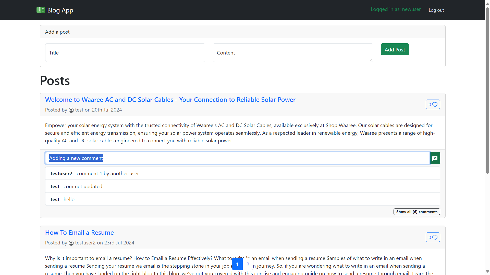

# Django Blog Application

## Project Setup

### Prerequisites
- Python 3.x
- Node.js and npm

### Backend Setup (Django)
1. Vavigate to the backend directory:
    ```sh
    cd backend
2. Create a virtual environment and activate it:
    ```sh
    python -m venv myenv
    # On Windows
    myenv\Scripts\activate
    # On macOS/Linux
    source myenv/bin/activate
    ```
3. Install required packages:
    ```sh
    pip install -r requirements.txt
    ```
4. Apply migrations:
    ```sh
    python manage.py makemigrations
    python manage.py migrate
    ```

### Frontend Setup (React)
1. Navigate to the frontend app:
    ```sh
    cd frontend
    ```
2. Install dependencies:
    ```sh
    npm install
    ```
3. Set up proxy to backend in `package.json`:
    ```json
    {
      "proxy": "http://localhost:8000"
    }
    ```

### Running the Application
1. Run the Django server:
    ```sh
    python manage.py runserver
    ```
2. Run the React app:
    ```sh
    cd frontend
    npm start
    ```

3. Runs the app in the development mode.\
Open [http://localhost:3000](http://localhost:3000) to view it in your browser.

### API Endpoints
- `/posts/` - List and create posts
- `/posts/<id>/` - Retrieve, update, delete a post
- `/comments/` - List and create comments
- `/comments/<id>` - Retrieve, update, delete a comment
- `/posts/<id>/like/` - To like/unlike a post
- `register/` - To sign up
- `login/` - Login with credentials to get jwt token,
- `token/refresh/` - To refresh an existing token,
- `logout/` - Log out the current user

### Authentication
- Implemented token-based authentication using `djangorestframework-simplejwt`.

### Additional Features
- Signup/Login
- Pagination for posts
- Post likes functionality
- Add/Edit/Delete a post
- Add/Edit/Delete a comment

### Testing
- Added Model/Views unit tests, you can run using below command
```sh
python manage.py test
```


<br/>
<hr>
<br/>


# Walk through

> Without Loging, any user can read the blogs, see comments and likes

- The likes are shown but user can't like/unlike them
- User can read comments, but they can't add a new comment or edit/delete a comment on a post by them
- User can read blogs, but they have not option to add a new blog unless logged in

### Home page
- Page 1

- Page 2


#### Let's expand all the Comments of Blog 1


#### Blog Details page


### Signup page


- Upon successful signup, the user is redirected to the login page


### Login page


> Once user is logged in, they can

- Add a new post
- Edit/delete their post
- Add a new comment on a post
- Edit/delete their comment

### Home page after login


#### Add a new post


- Post added successfully
- NOTICE: A new post has been added at the top of older posts. The post is highlited with greeen-border that means, this post belongs to the logged in user. And furthermore, they have options to edit and delete the post.


#### Update a post (Modal is opened)

- Post updated (see the title changes)


#### Add a new comment

- comment added


#### Edit the comment (Modal is opened)


- Comment updated


#### Read a specific post


#### Delete a comment

- comment deleted


#### Delete a post (user can delete their post only)
- NOTICE: Edit and delete options are available only to the user-specific posts


- post deleted


### Like a post
- NOTICE: The like count has increased, color changed to green and filled

